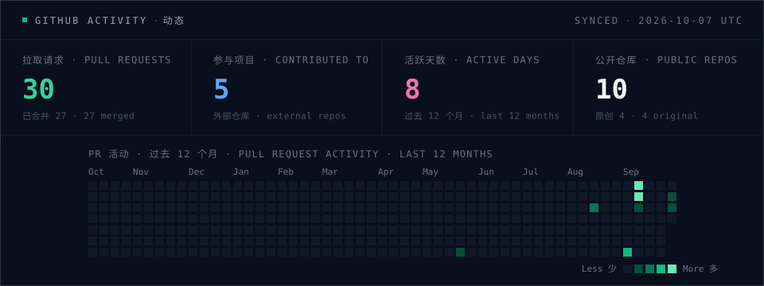

<picture>
  <source media="(prefers-color-scheme: dark)" srcset="assets/hero-dark.svg">
  <source media="(prefers-color-scheme: light)" srcset="assets/hero-light.svg">
  
</picture>

[nyco.cloud](https://nyco.cloud) · [AS197817](https://bgp.tools/as/197817) · [NCN-Platform](https://github.com/Cloudnyco/NCN-Platform)

### 关于 · About

我运营 **Nyco Cloud Network（AS197817）**，一张多 PoP 的 IPv6 任播网络，并为它写了一套自托管的运维平台。平时也给喜欢的桌面应用和游戏同人项目提 PR。

I run **Nyco Cloud Network (AS197817)**, a multi-PoP IPv6 anycast network, and build the self-hosted platform that operates it. I also send pull requests to desktop apps and fan game projects I enjoy.

### 项目 · Projects

| 项目 · Project | 说明 · Notes |
|---|---|
| [**NCN-Platform**](https://github.com/Cloudnyco/NCN-Platform) Go · Vue · TypeScript | 多 PoP 任播网络的自托管运维平台：BGP/BIRD 遥测、RPKI 监控、告警、DDoS 缓解、单点登录。 Self-hosted operations platform for a multi-PoP anycast network: BGP/BIRD telemetry, RPKI monitoring, alerting, DDoS mitigation, SSO. |
| [**Nori**](https://github.com/MF-Dust/Nori.Desktop) C# · Avalonia · JavaScript | 桌面端与网页端合并了 25 个 PR：原生 Avalonia 界面、WASAPI 音频后端、账户与云端存档同步、Agent 工具与授权档位。 25 merged PRs across the desktop and web apps: native Avalonia UI, WASAPI audio backend, account and cloud save sync, agent tools and permission tiers. |
| [**Stronghold-Protocol**](https://github.com/sganggs/Stronghold-Protocol) JavaScript | 明日方舟「卫戍协议：盟约」同人复刻：3D 棋盘贴图改用 WebP（[#186](https://github.com/sganggs/Stronghold-Protocol/pull/186)），战斗性能测试工具（[#198](https://github.com/sganggs/Stronghold-Protocol/pull/198)）。 Arknights fan remake: WebP board textures (#186) and a battle performance benchmark (#198). |

### 动态 · Activity

<picture>
  <source media="(prefers-color-scheme: dark)" srcset="assets/stats-dark.svg">
  <source media="(prefers-color-scheme: light)" srcset="assets/stats-light.svg">
  
</picture>

由 GitHub Actions 每天根据公开仓库中的 PR 生成（[scripts/build.mjs](scripts/build.mjs)）。Generated daily by GitHub Actions from pull requests in public repositories.
